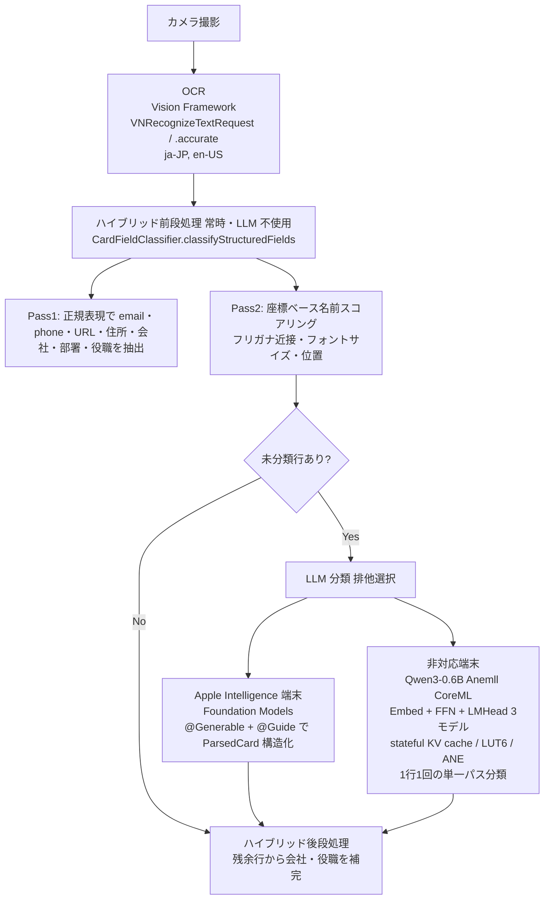

# eMeishi

iPhoneで名刺をスマートに管理するアプリ。カメラで撮影するだけで、AIが名前・会社名・連絡先を自動で読み取り、整理して保存します。

## 主な機能

- **カメラ撮影 + AI自動読み取り** — OCR + オンデバイスAI（Apple Intelligence / Qwen3-0.6B）で名刺のフィールドを自動分類。連続撮影にも対応
- **ふりがな自動生成** — 名前・会社名のふりがなを自動取得。名前順・会社名順ソートに使用
- **連絡先連携** — iPhoneの連絡先へワンタップ保存、連絡先からのインポート
- **CSV / vCard エクスポート** — Excel対応のCSV（UTF-8 BOM付き）、vCard 3.0/4.0
- **重複検出 + マージ** — Levenshtein距離ベースの類似度判定 + AIによるボーダーライン二次判定
- **タグ管理** — ユーザー定義タグ（名前・色・並べ替え）で自由にグループ分け
- **AI自然言語検索** — 「先月会った渋谷のエンジニア」のような自然文で名刺を検索
- **人脈インサイト** — 会社別・エリア別・職種別・月別の統計
- **セキュリティ** — Face ID / Touch ID によるアプリロック、App Switcherでのコンテンツ隠蔽
- **iCloud同期**（オプション） — 同じApple IDのデバイス間で名刺・タグを自動同期

## プライバシー

すべてのAI処理はデバイス上で実行されます。開発者が運営する外部サーバーへのデータ送信は一切ありません。iCloud同期はオプトイン方式で、CloudKit Private Databaseに保存されたデータは開発者を含む第三者が閲覧できません。

## 技術スタック

| 項目 | 技術 |
|------|------|
| UI | SwiftUI |
| データ永続化 | CoreData + NSPersistentCloudKitContainer |
| OCR | Vision Framework（VNRecognizeTextRequest） |
| AI分析（Apple Intelligence対応端末） | Foundation Models（iOS 26+） |
| AI分析（非対応端末） | Qwen3-0.6B Anemll CoreML（Embed+FFN+LMHead 3モデル・ANE対応） |
| カメラ | AVFoundation |
| 連絡先 | Contacts Framework |
| 生体認証 | LocalAuthentication |
| モデル配布 | CloudKit Public Database |

## アーキテクチャ（AI 処理の流れ）



ルールベースの抽出結果が常に LLM より優先されます。LLM エンジンは排他利用（フォールバック連鎖なし）です。

## ディレクトリ構成

```text
meishi-app/
├── CLAUDE.md
├── README.md
├── eMeishi/
│   ├── Info.plist                              # Release 用（UIFileSharingEnabled=false）
│   ├── Info-Debug.plist                        # Debug 用（UIFileSharingEnabled=true・開発用モデル転送）
│   ├── eMeishi.entitlements                    # CloudKit・iCloud 同期・アプリグループ等
│   ├── Config/
│   │   ├── Debug.xcconfig                      # INFOPLIST_FILE=Info-Debug.plist・SWIFT_ACTIVE_COMPILATION_CONDITIONS=DEBUG
│   │   └── Release.xcconfig                    # INFOPLIST_FILE=Info.plist・DEBUG 条件コード除外
│   ├── App/
│   │   ├── eMeishiApp.swift
│   │   └── PersistenceController.swift          # CoreData スタック・軽量マイグレーション設定
│   ├── Models/
│   │   ├── BusinessCard+CoreDataClass.swift
│   │   ├── BusinessCard+CoreDataProperties.swift
│   │   ├── Tag+CoreDataClass.swift
│   │   └── Tag+CoreDataProperties.swift
│   ├── ContentView.swift                        # ルートレベルに配置
│   ├── Views/
│   │   ├── CardListView.swift
│   │   ├── CardDetailView.swift
│   │   ├── CardFormView.swift
│   │   ├── CameraView.swift                    # 連続撮影カメラ（CameraBatchCapture・純UIKit管理・標準カメラUI+オーバーレイ）
│   │   ├── BatchReviewView.swift               # 連続撮影後の一括確認（CardFormViewを順番に表示）
│   │   ├── AISearchChatView.swift              # AI自然言語検索のチャットUI
│   │   ├── DuplicateListView.swift              # 重複候補一覧
│   │   ├── DuplicateMergeView.swift             # マージUI
│   │   ├── BulkTagAssignView.swift             # 一括タグ付けシート（選択モード用）
│   │   ├── TagManagementView.swift             # タグ管理（作成・削除・色変更・並べ替え）
│   │   ├── LockScreenView.swift                # 生体認証ロック画面
│   │   ├── PrivacyOverlayView.swift            # App Switcher プライバシーオーバーレイ
│   │   ├── InsightsView.swift                  # 人脈インサイト（会社別・エリア別・職種別・月別統計）
│   │   ├── SettingsView.swift                  # 読み取り方法・エクスポート設定・セキュリティ・モデル管理・プライバシーポリシー/サポートリンク
│   │   └── Components/
│   │       ├── CardRowView.swift               # 一覧行セル
│   │       └── SectionIndexView.swift          # 50音セクションインデックス
│   ├── ViewModels/
│   │   ├── CardListViewModel.swift
│   │   ├── CardFormViewModel.swift
│   │   └── SettingsStore.swift                 # UserDefaults ラッパー・ReadingMethod enum
│   ├── Services/
│   │   ├── AuthenticationService.swift         # 生体認証（Face ID / Touch ID）ラッパー
│   │   ├── OCRService.swift
│   │   ├── ContactsService.swift
│   │   ├── ExportService.swift
│   │   ├── CloudKitModelService.swift          # CloudKit Public DB からモデルDL・Embed/FFN/LMHead 3モデル対応・weight チャンク結合
│   │   ├── CloudKitModelUploader.swift         # #if DEBUG 限定のモデルアップローダ（開発者向け）
│   │   ├── LocalLLMService.swift               # Anemll Qwen3-0.6B ANE対応 CoreML 推論（Embed+FFN+LMHead）・stateful KV cache・Documents/AppSupport 二重パス
│   │   ├── AISearchService.swift               # AI自然言語検索（時間表現抽出 + フィールド分類）
│   │   ├── AutoTagService.swift                # AI自動タグ提案（既存タグからカード内容に該当するものを提案）
│   │   ├── InsightsService.swift               # 人脈インサイト集計（会社別・エリア別・職種別・月別）
│   │   └── Qwen25Tokenizer.swift               # BPE トークナイザー（Qwen3互換）
│   ├── Utilities/
│   │   ├── AppLogger.swift                     # os.Logger ラッパー
│   │   ├── CardFieldClassifier.swift           # 正規表現ベースのフィールド分類（ハイブリッド前段処理）
│   │   ├── CardGroupingService.swift           # 50音セクション分割
│   │   ├── ContactPatternExtractor.swift       # email/phone/URL/住所の正規表現抽出
│   │   ├── DuplicateChecker.swift              # Levenshtein 距離による重複判定
│   │   ├── FieldDetector.swift                 # OCR 行からフィールド種別の初期判定
│   │   ├── FlowLayout.swift                    # SwiftUI タグ折返しレイアウト
│   │   ├── LegalEntityTerms.swift              # 法人格リスト一元管理（漢字・読み・英語・略称）
│   │   ├── NameProcessor.swift                 # 名前の分割・正規化
│   │   ├── NameReadingGenerator.swift          # ふりがな自動生成（CFStringTokenizer）
│   │   └── ShareSheet.swift                    # UIActivityViewController ラッパー
│   ├── Resources/
│   │   └── BusinessCard.xcdatamodeld           # v1（初期）・v2（department追加）・v3（reading追加）・v4（isFavorite+Tag追加）・v5（Tag.sortOrder追加）の5バージョン
│   ├── AppIcon.icon/                           # アプリアイコン
│   └── Assets.xcassets                         # アクセントカラー
├── eMeishiTests/
│   └── eMeishiTests.swift                      # 機能テスト網羅的に実装済み
├── eMeishiUITests/
│   ├── eMeishiUITests.swift                  # UIテスト（コンテキストメニュー・選択モード・検索・ナビゲーション）
│   └── eMeishiUITestsLaunchTests.swift       # 起動テスト
├── scripts/
│   └── pre-build-check.sh                      # ビルド前検証（ビルド番号・Info.plist 整合性・権限）
├── docs/                                       # GitHub Pages（プライバシーポリシー・サポート・ランディング）
├── metadata/                                   # App Store Connect メタデータ
│   ├── app_info.yaml                           # アプリ基本情報（カテゴリ・URL 等）
│   └── version/<x.y.z>/ja.json                 # バージョンごとの description・keywords・whatsNew
├── .asc/                                       # ASC 向け設定（screenshots.json・shots.settings.json）
├── screenshots/raw/{iphone69,ipad13}/          # App Store スクリーンショット（必要サイズのみ追跡）
└── ExportOptions.plist                         # xcodebuild 手動 export 用
```

## 要件

- iOS 26.0 以降
- Xcode 26.0 以降
- iPhone（実機推奨。シミュレータではAI機能が制限されます）

## ビルド

```bash
git clone https://github.com/hannaheptapod/meishi-app.git
cd meishi-app
open eMeishi.xcodeproj
```

Xcode でビルドターゲットを選択し、実機またはシミュレータで実行してください。

> **Note:** Foundation Models は iPhone 15 Pro 以降 + Apple Intelligence 有効の実機でのみ動作します。Qwen3-0.6B CoreML はシミュレータでも動作しますが低速です。

## CI/CD（Xcode Cloud）

### 現状（As Is）

| ワークフロー | トリガー | アクション | テスト実行 |
|---|---|---|---|
| PR Validation | PR → `develop` | Build | **なし** |
| Develop Integration | push → `develop` | Build | **なし** |
| Release Build | push → `release/*` | Archive + TestFlight 配信 | **なし** |

- Xcode Cloud の初期セットアップ済み（GitHub 連携・署名・App 確認）
- `ci_scripts/` にビルド番号自動生成・バリデーション・ログのスクリプト配置済み
- `eMeishi-CI.xctestplan` 作成済み（ScreenshotRunnerTests を除外）
- テストアクションは ASC API の `testDestinations` 形式問題で未設定
### 目標（To Be）

| ワークフロー | トリガー | アクション | テスト実行 |
|---|---|---|---|
| PR Validation | PR → `develop` | Build + **Test** | **Unit Tests のみ** |
| Develop Integration | push → `develop` | Build + **Test** | **Unit + UI Tests**（eMeishi-CI.xctestplan） |
| Release Build | push → `release/*` | Archive → **TestFlight** | なし（Archive のみ） |

### 残作業

1. PR Validation・Develop Integration に TEST アクション追加（`testDestinations` の正しい形式で再設定）
2. develop マージ後の初回ビルド成功を確認

### CI スクリプト構成

```
ci_scripts/
├── ci_post_clone.sh        # クローン後ログ（特別な処理なし）
├── ci_pre_xcodebuild.sh    # ビルド前バリデーション（Info.plist 整合性・xcconfig 等）
└── ci_post_xcodebuild.sh   # ビルド後ログ出力
```

- ビルド番号（`CURRENT_PROJECT_VERSION`）は Xcode Cloud が `CI_BUILD_NUMBER`（連番）を自動注入する。カスタム形式は使わない
- TestFlight 配信は Xcode Cloud の Release Build ワークフローの Distribution Preparation（App Store Connect）+ Post-Action（Internal Testing）で行う
- `ci_pre_xcodebuild.sh` は `scripts/pre-build-check.sh` の CI 版。asc CLI 依存の 3 項目（ビルド番号比較・証明書・プロファイル）はスキップ
- テストプラン `eMeishi-CI.xctestplan` は ScreenshotRunnerTests を除外（App Store スクリーンショット専用のため CI では不要）
- **`release/*` への push は必ず Archive + TestFlight 配信を起動する。** ASC 提出後は `asc review submissions-update --canceled=true` で取り下げない限り push 禁止
- **メタデータ（What's New・スクリーンショット等）の変更は `release/*` に載せず、`chore/release-*-metadata` ブランチで develop に流す**（build に無関係なため）

## ライセンス

[MIT License](LICENSE)
